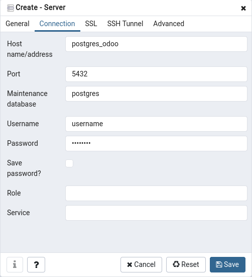

# Odoo 12 docker-compose.yml with pgAdmin4

docker-compose.yml file that installs:
- Odoo 12
- postgres 10
- pgAdmin4

## Configuration:

Postgres access configuration:
```
postgres_odoo:                      <- container name
    image: postgres:10
    restart: always
    environment:
      - POSTGRES_DB=postgres        <- admin database - do not change this
      - POSTGRES_PASSWORD=password  <- postgres password
      - POSTGRES_USER=username      <- postgres username
    networks:
      - odoo
```

Now configure the same user and password in the `odoo` container:
```
odoo:                              <- container name
    image: odoo:12.0
    depends_on:
      - postgres_odoo              <- waits until postgres container starts
    restart: always
    volumes:
      - ./addons:/mnt/extra-addons <- creates addons/ folder for the custom modules you might install
    ports:
      - "8069:8069"                <- exposes the port 8069 of the host machine, to change: "other:8069"
    networks:
      - odoo 
    environment:
      - HOST=postgres_odoo         <- container name of the database
      - USER=username              <- postgres username
      - PASSWORD=password          <- postgres password
```

And last but not least, configure pgAdmin4:
```
pgadmin_odoo:                      <- container name
    image: dpage/pgadmin4
    environment:
      - PGADMIN_DEFAULT_EMAIL=user@example.org   <- pgadmin username (must be and mail, can be fake)
      - PGADMIN_DEFAULT_PASSWORD=password        <- pgadmin password
    restart: always
    ports:
      - "8080:80"                  <- exposes port 8080 and binds it to port 80 inside container 
    networks:
      - odoo
```

## Run commands

To configure everything for first time:
```
docker-compose up -d
```
> Use `-d` to detach the container from the terminal, can be useful to remove this if you're facing errors
> because you can see the install logs.

Then to stop and start the containers:
```
docker-compose start/stop
``` 

To remove everything and start from zero:
```
docker-compose down -v
```

## pgAdmin server configuration:


